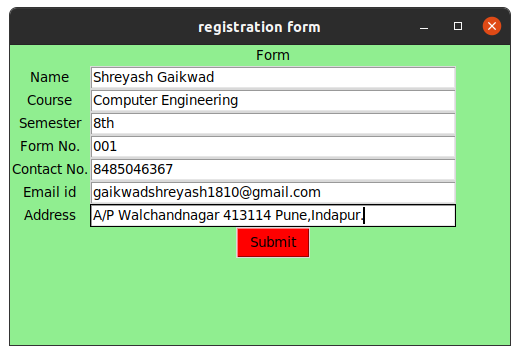
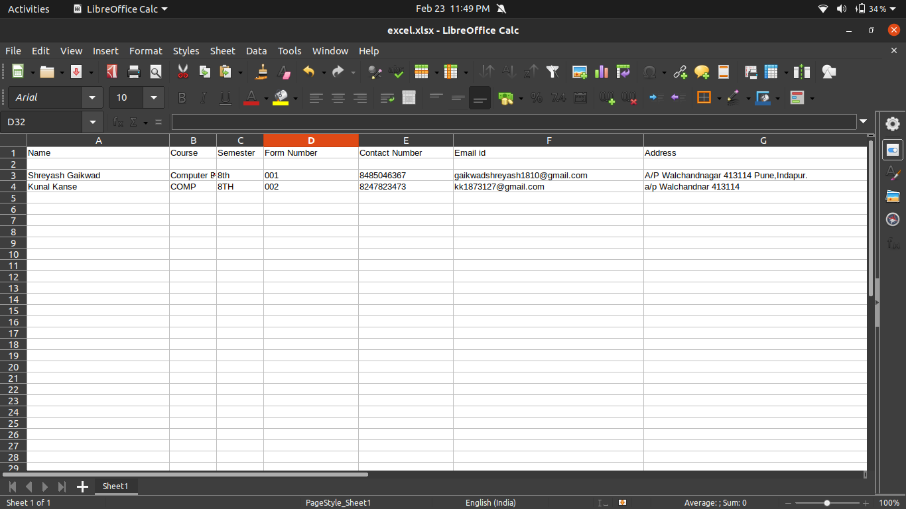

<h1 align="center">Simple-registration-form-using-Python</h1>
<h3 align="center" color="blue">Prerequisites: Tkinter Introduction, openpyxl module.  
Python provides the Tkinter toolkit to develop GUI applications. Now, it’s upto the imagination or necessity of developer, what he/she want to develop using this toolkit. Let’s make a simple information form GUI application using Tkinter. In this application, User has to fill up the required information, and that information is automatically written into an excel file.

Firstly, create an empty excel file, after that pass an absolute path of the excel file in the program so that the program is able to access that excel file.</h3>

<h1 align="center">Home page</h1>
  
<h1 align="center">when you click on Submit button, info you filled are updated in Excel sheet</h1> 
  
